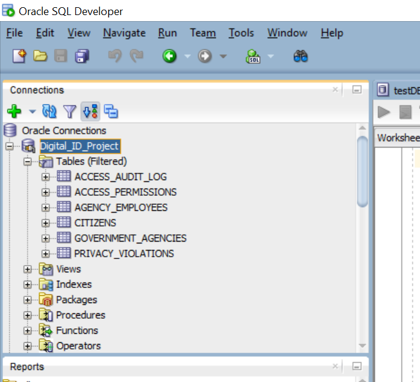

# Digital ID Data Privacy and Access Monitoring System

> **Capstone Project | Database Development with PL/SQL**
> *Adventist University of Central Africa (AUCA)*

---

## 👤 Author Information

| Field | Detail |
| :--- | :--- |
| **Student Name** | **Olivier** |
| **Student ID** | **27119** |
| **Group** | Monday |
| **Lecturer** | Eric Maniraguha |
| **Database PDB** | `Mon_27119_Olivier_DigitalID_db` |

---

## 📑 Table of Contents
1. [Project Overview](#-project-overview)
2. [Key Objectives](#-key-objectives)
3. [System Architecture](#-system-architecture)
4. [Folder Structure](#-folder-structure)
5. [Documentation & BI](#-documentation--bi)
6. [Screenshots](#-screenshots)
7. [Quick Start Guide](#-quick-start-guide)

---

## 📖 Project Overview

### 🚩 Problem Statement
Rwanda is rolling out Digital National IDs under the **NST2** program, centralizing sensitive biometric, health, and financial data. Currently, citizens lack **control or visibility** over which government agencies (like RRA, MINISANTE) access this data. There is no transparent mechanism to prevent unauthorized access or trace data misuse, leading to potential privacy violations.

### 💡 Proposed Solution
This project implements a secure **PL/SQL Oracle Database System** that empowers citizens to control their digital footprint. It introduces a **Permission-Based Access Control System** where citizens grant specific data categories (e.g., "Financial Data Only") to agencies for limited durations. The system features **immutable audit logging** and **automatic violation detection**.

---

## 🎯 Key Objectives

* **Granular Permissions:** Citizens authorize access by category (Personal, Financial, Health) with strict expiry dates.
* **Immutable Auditing:** A tamper-proof `ACCESS_AUDIT_LOG` records every single data access attempt (Who, When, Why).
* **Violation Detection:** Automated PL/SQL triggers flag suspicious activities (e.g., access without permission, after-hours queries).
* **Citizen Transparency:** BI Dashboards provide citizens with a full report of who accessed their data.

---

## 🏗 System Architecture

The database is built on a **3NF Normalized Schema** consisting of 6 core tables:
1.  **CITIZENS:** Core identity data.
2.  **GOVERNMENT_AGENCIES:** Entities requesting access.
3.  **AGENCY_EMPLOYEES:** System users.
4.  **ACCESS_PERMISSIONS:** The rulebook for data access.
5.  **ACCESS_AUDIT_LOG:** The history of all actions.
6.  **PRIVACY_VIOLATIONS:** Alerts for security breaches.

---

## 📂 Folder Structure

This repository is organized to separate SQL logic, documentation, and BI analytics.

your-project-repo/
├── README.md                  
├── database/
│   ├── scripts/               # ⚙️ Source SQL Code
│   │   ├── 01_create_pdb.sql          # Phase 4: PDB Creation
│   │   ├── 02_create_tables.sql       # Phase 5: Table Structures
│   │   ├── 03_insert_data.sql         # Phase 5: Sample Data
│   │   ├── 04_validation_queries.sql  # Phase 5: Integrity Checks
│   │   └── 05_test_queries.sql        # Phase 6: Logic Testing
│   └── documentation/         # 📘 DB Setup Docs
├── queries/                   # 🔍 Reporting & Auditing
│   ├── data_retrieval.sql
│   ├── analytics_queries.sql
│   └── audit_queries.sql
├── business_intelligence/     # 📊 BI Strategy
│   ├── bi_requirements.md
│   ├── dashboards.md
│   └── kpi_definitions.md
├── screenshots/               # 📸 Proof of Implementation
│   ├── oem_monitoring/
│   ├── database_objects/
│   └── test_results/
└── documentation/             # 📚 System Documentation
    ├── data_dictionary.md
    ├── architecture.md
    └── design_decisions.md

## 📚 Documentation & BI

### Critical Note: 
Full technical details are available in the linked documents below.

### Document                  Description
**Data Dictionary:**           *Detailed breakdown of all 6 tables, columns, types, and constraints.*
**System Architecture:**       *High-level design diagrams (ERD) and relationship explanations.*
**Design Decisions:**          *Justification for 3NF normalization and security logic.*
**BI RequirementsKPI:**        *definitions and dashboard mockups for decision support.*

## 📸 Screenshots
1. Database Objects (SQL Developer)
(Add your screenshot of the tables list here) 

2. ER Diagram
(Add your ER Diagram screenshot here) 

3. Test Results (Audit Log)
(Add a screenshot of a query result showing audit logs) 

## 🚀 Quick Start Guide
Follow these steps to deploy the project locally.

### Prerequisites
1. Oracle Database 21c (XE or Enterprise)
2. Oracle SQL Developer

## Phase 4: Database Creation

1. Open SQL Developer and connect as SYSDBA.
2. Run database/scripts/01_create_pdb.sql to create the PDB and Admin User.

## Phase 5: Schema Implementation

1. Connect as digital_id_user.
2. Run database/scripts/02_create_tables.sql to build the structure.
3. Run database/scripts/03_insert_data.sql to load 100+ sample records.

## Verification
1. Run database/scripts/04_validation_queries.sql to confirm data integrity.